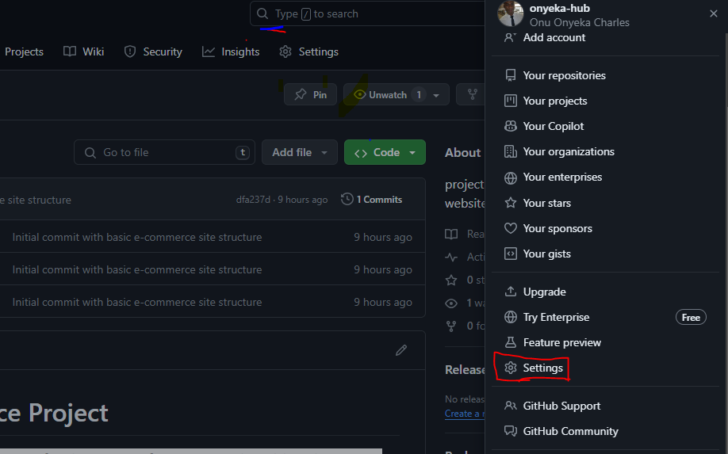

# MarketPeak_Ecommerce Project


Initialise your git repo on your local machine

```
mkdir MarketPeak_Ecommerce
cd MarketPeak_Ecommerce
git init
```


You can obtain the template from [here](https://www.tooplate.com/view/2130-Onyeka-Onu)


Stage and commit the template to git
```
git add .
git config --global user.name "YourUsername"
git config --global user.email "youremail@example.com"
git commit -m "Initial commit with basic e-commerce site structure"
```


```
git remote add origin https://github.com/onyeka-hub/MarketPeak_Ecommerce.git
git branch -M main
git push -u origin main
```

## AWS Deployment

To deploy MarketPeak_Ecommerce platform you will start by setting up an aws ec2 instance

Login to the aws console, launch an ec2 instance using an Amazon linux AMI and connect into it using ssh


Display and copy the public key

```
cat /home/ec2-user/.ssh/id_rsa.pub
```

Add the ssh public key to your github account




Use the ssh url to clone the repository. Install git if its not install on the server.

```
sudo yum install git
git clone git@github.com:onyeka-hub/MarketPeak_Ecommerce.git
```


```
sudo yum update -y
sudo yum install httpd -y
sudo systemctl start httpd
sudo systemctl enable httpd
```


```
sudo rm -rf /var/www/html/*
sudo cp -r MarketPeak_Ecommerce/2130_waso_strategy/* /var/www/html/
sudo systemctl reload httpd
```


### Continuous Integration and Deployment workflow

#### Step 1: Developing new features and fixes

- Create a development branch. Begin your development work by creating a seperate branch. This isolates new features and bug fixes frm the stable version of your website
```
git branch development
git checkout development

Or the above two can be combined in one command as below
git checkout -b development
```
- Implement changes. On the development branch, add your new features or bug fixes. This might include updating web pages, adding new products or fixing known issues.

I added some images and edited the html file to add some address and numbers.

#### Step 2: Version control with Git
- Stage your changes. After making your changes, add them to the staging area in Git. This prepares the changes for a commit.

- Commit your changes.

- Push to Github. Upload your development branch with the new changes to Github.

#### Step 3: Pull Request and Merging to the main branch

- Create a pull request (PR). On github, create a pull request to merge the development branch into the main branch. This process is created for code review and maintaining code quality.

- Review and merge the PR

- Push the merged changes to github. Ensure that your local branch now containing the updates is pushed to the remote repository on github.

#### Step 4: Deploying updates to the production server.

- Pull the latest changes to the production server. SSH into the AWS ec2 instance where the production website is hosted and update the website's directory with the latest changes.

- Restart the webserver (if necessary)

#### Step 5: Testing the new changes.

- Access the website from the browser with the public IP address of the instance. Test the new features or fixes to ensure that it is working as expected in the live environment

This workflow emphasizes best practices in software development and deployment, including branch management, code review through pull request and continuous integration/deployment strategies. By following these steps, you maintain a stable and up-to-date production environment for your e-commerce platform.